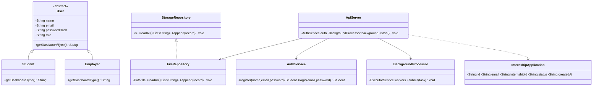

# CareerBridge Java Backend - UML Class Diagram

```mermaid
classDiagram
  class User {
    <<abstract>>
    -String name
    -String email
    -String passwordHash
    -String role
    +getDashboardType()* String
  }
  class Student { +getDashboardType() String }
  class Employer { +getDashboardType() String }
  class InternshipApplication { -String id -String email -String internshipId -String status -String createdAt }
  class StorageRepository { <<interface>> +readAll() List~String~ +append(record) void }
  class FileRepository { -Path file +readAll() List~String~ +append(record) void }
  class AuthService { +register(name,email,password) Student +login(email,password) Student }
  class BackgroundProcessor { -ExecutorService workers +submit(task) void }
  class ApiServer { -AuthService auth -BackgroundProcessor background +start() void }
  User <|-- Student
  User <|-- Employer
  StorageRepository <|.. FileRepository
  ApiServer --> AuthService
  ApiServer --> BackgroundProcessor
  ApiServer --> FileRepository
  ApiServer ..> InternshipApplication
```
